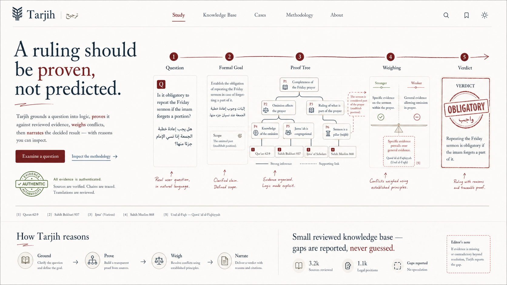
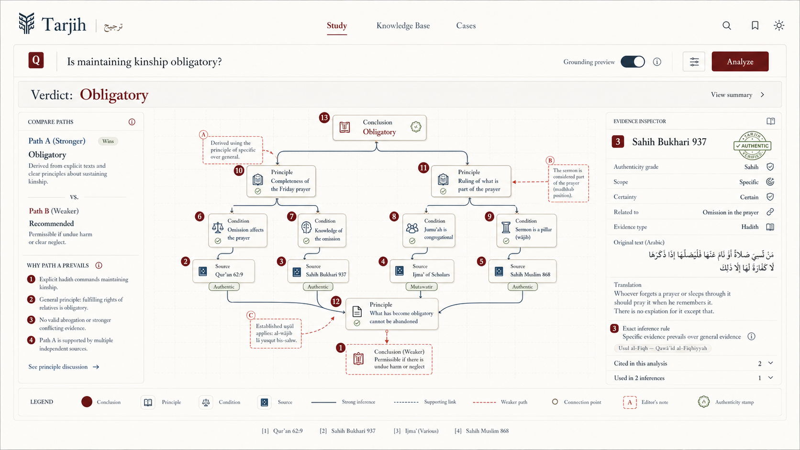
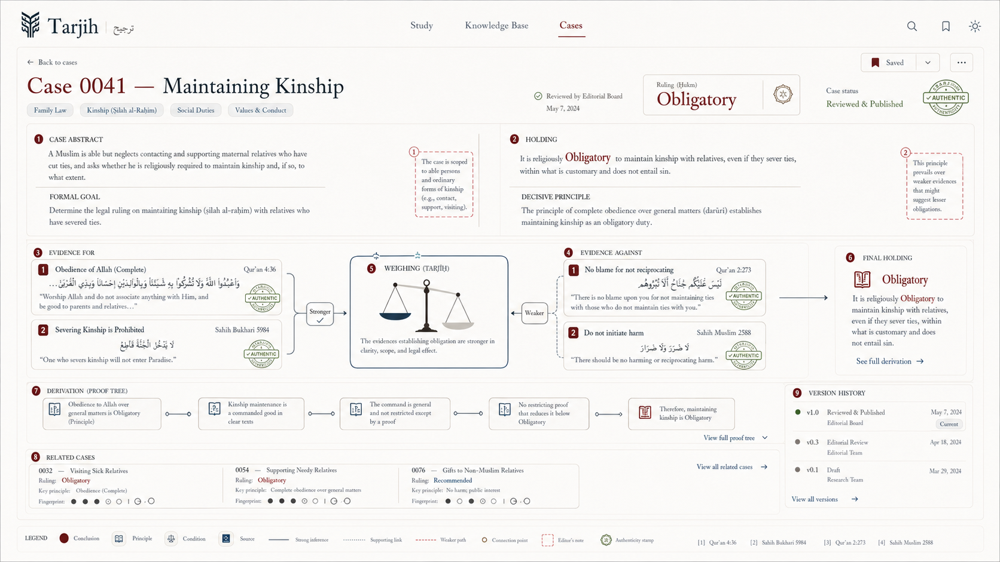
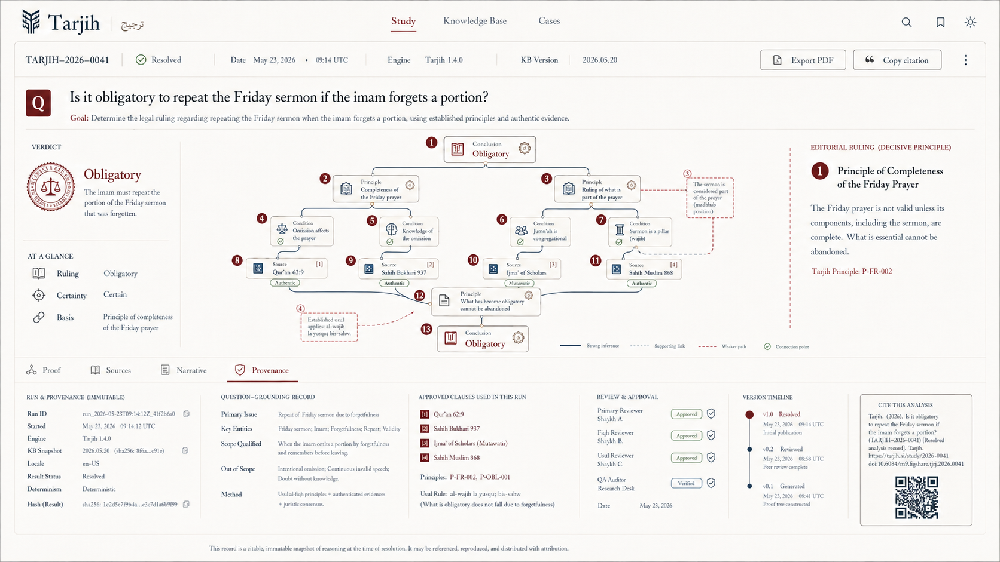

<h1>
  
  Tarjih
</h1>

Tarjih (ترجيح, "weighing") is an experiment in explainable Islamic legal
reasoning. Instead of asking an LLM to guess a fatwa, it asks a question,
converts it into a formal logical goal, and proves it against a hand-built
knowledge base using a real backward-chaining inference engine — the same
family of technique as classical Prolog/expert systems. When the evidence
conflicts, it resolves the conflict using the classical rules jurists
themselves use for weighing conflicting evidence (*al-murajjihat*), and only
then asks an LLM to explain the result in plain language.

## App pages

| Home | Study |
| --- | --- |
|  |  |
| **Cases** | **Study detail** |
|  |  |

The repository includes these current page captures in `design/`, covering the public landing, study experience, cases ledger, and study detail view.

The LLM never decides the ruling. It only translates the question into
something the engine can prove, and narrates the answer the engine already
computed.

## How it works

```
question
  → LLM grounds it into a goal, e.g. ruling(mistreat(aunt_maternal), H)
  → engine proves every way that goal can be derived from the knowledge base
  → if derivations disagree, they're weighed against each other
    (specific text beats general, certain beats probable, text beats analogy, ...)
  → LLM narrates the already-decided verdict and cites the real sources used
```

Every step is inspectable: which clauses fired, which source text backs each
one, and — when there's a conflict — exactly which rule decided it and why.

## The knowledge base

The KB is a set of Horn clauses (like `ruling(mistreat(X), haram) :-
kin(X, ego), causes(mistreat(X), darar).`) written in a small Prolog-like
syntax, each one tagged with evidence: its source (Qur'an, hadith, analogy,
legal maxim...), authenticity grade, and attributes classical usul al-fiqh
uses for weighing (general vs. specific, certain vs. probable, etc).

Two ways clauses get added:

- **Hand-authored** — a small, carefully reviewed core covering a few real
  cases end to end (`src/lib/kb/core/`).
- **Formalized from hadith** — hadiths are scraped from sunnah.com (which
  includes authenticity grading, unlike the old ungraded corpus this project
  started with) and run through an LLM that proposes a candidate clause.
  Every candidate is validated against the fixed logical vocabulary before it's
  even stored, and it sits in a review queue — nothing an LLM proposes reaches
  a live query until a human approves it.

## Pages

| Page | What it's for |
|---|---|
| `/study` | The main interface. Ask a question, see the verdict, the proof tree, the cited sources, and — if the evidence conflicted — exactly how it was resolved. |
| `/database` | Browse the knowledge base: every hand-authored clause and its evidence, plus a review queue for approving or rejecting LLM-formalized hadith clauses. |
| `/cases` | A ledger of past resolved questions. |
| `/` , `/profile`, `/settings` | Landing page and account pages carried over from the original template — mostly static/decorative, not wired to the engine. |

## Project layout

```
src/lib/logic/      terms, unification, the clause parser
src/lib/engine/      the backward-chaining prover
src/lib/kb/          predicate vocabulary, evidence model, the knowledge base itself
src/lib/tarjih/      conflict detection + evidence weighing
src/lib/pipeline/    question → goal → prove → weigh → narrate
src/lib/scrape/      the sunnah.com scraper
src/scripts/         CLI scripts: scrape hadiths, run them through formalization
```

## Running it

```bash
pnpm install
pnpm dev              # http://localhost:1919
pnpm test             # run the test suite
```

You'll need a `GROQ_API_KEY` in `.env` for the question-answering pipeline to
work (it's the only external LLM call the engine depends on).

To grow the knowledge base:

```bash
pnpm scrape:hadith tirmidhi 1 50      # scrape hadiths 1-50 from a collection
pnpm formalize:hadith 20              # run 20 pending hadiths through formalization
```

Formalized clauses land in the review queue at `/database` — nothing is
added to live queries automatically.

## Status

This is a rewrite in progress, not a finished product. The engine and
weighing logic are real and tested; the knowledge base itself is still small
and covers a handful of cases end to end. Expect gaps — a question outside
what's been formalized will honestly say so rather than guess.
