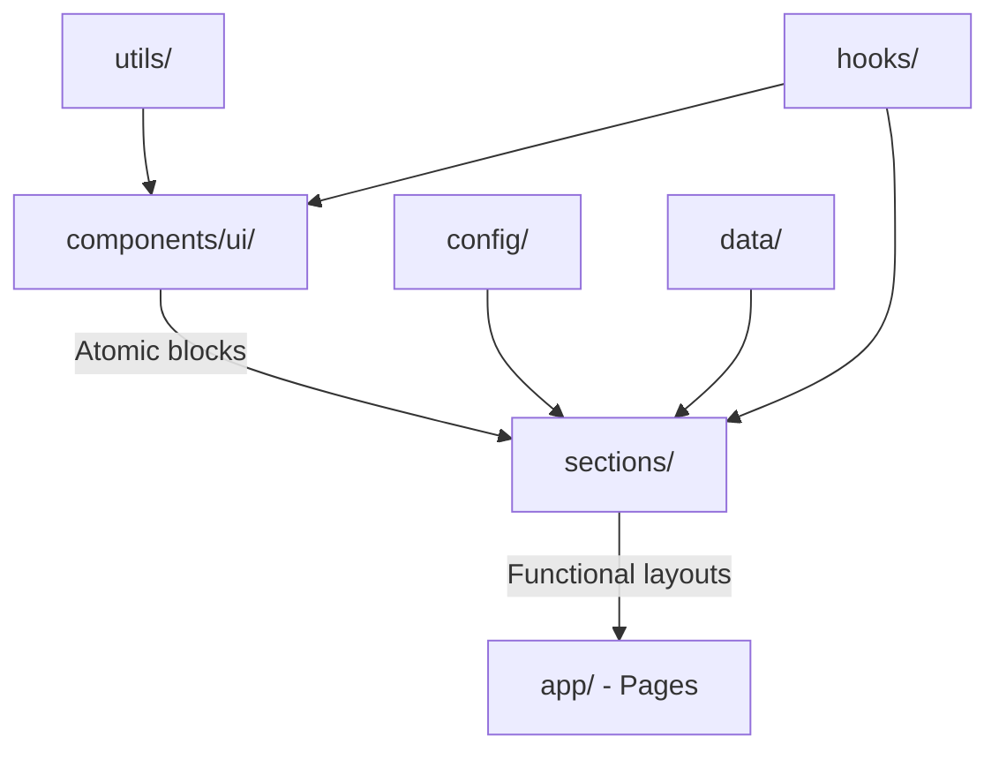

# Source Directory Overview & Guidelines

This directory contains the core application codebase. We enforce a strict **compositional design pattern** to ensure scalability, reusability, and code clarity.

## The Core Concept: Composition Flow

Our architecture flows from atomic building blocks to complete pages:

### 1. `components/` (Atomic UI Blocks)
* **Responsibility**: Pure visual and highly reusable atomic building blocks (Buttons, Inputs, Cards, Badges, Modals).
* **Rule**: They should be mostly stateless, customizable via props, and unaware of specific API structures or domain model logic.
* **Layout**: Put them in a subfolder corresponding to their scope (e.g., `components/ui/` for generic blocks, `components/forms/` for form fields).

### 2. `sections/` (Page Layout Blocks)
* **Responsibility**: Compositional areas forming logical segments of a page (e.g., `Header`, `Hero`, `FeaturesGrid`, `PricingTable`, `Footer`).
* **Composition**: They assemble several `components` together, wire them up to states or event handlers, and lay them out side-by-side.
* **Rule**: Sections should avoid complex route-specific logic, but they *can* accept props to keep them flexible across pages.

### 3. `app/` (Pages and Routes)
* **Responsibility**: Defines paths, route configurations, metadata, layouts, and page-level layouts using the Next.js App Router.
* **Composition**: A page file (e.g., `app/page.tsx`, `app/dashboard/page.tsx`) simply lists and stacks various `sections` to build the full page view.
* **Rule**: Keep page files thin. Page-level state fetches or server-side calculations are done here and passed down as props to the respective sections.

---

## Folder Breakdown

| Folder | Purpose | Example Files |
| :--- | :--- | :--- |
| [`app/`](file:///d:/Programming/Web/Projects/tarjih/src/app) | Routing, layouts, and pages. | `page.tsx`, `layout.tsx`, `globals.css` |
| [`components/`](file:///d:/Programming/Web/Projects/tarjih/src/components) | Tiny reusable building blocks. | `ui/button.tsx`, `ui/card.tsx` |
| [`sections/`](file:///d:/Programming/Web/Projects/tarjih/src/sections) | Layout compositions for pages. | `hero.tsx`, `header.tsx`, `footer.tsx` |
| [`config/`](file:///d:/Programming/Web/Projects/tarjih/src/config) | Static configs, nav metadata, menu lists. | `site.ts` |
| [`data/`](file:///d:/Programming/Web/Projects/tarjih/src/data) | Static mock data structures. | `features-data.ts` |
| [`hooks/`](file:///d:/Programming/Web/Projects/tarjih/src/hooks) | Custom React hooks. | `use-boolean.ts` |
| [`style/`](file:///d:/Programming/Web/Projects/tarjih/src/style) | Custom design overrides & styling configuration. | `theme.css` |
| [`utils/`](file:///d:/Programming/Web/Projects/tarjih/src/utils) | Helper functions and pure utility functions. | `cn.ts` |

---

## Coding Best Practices

1. **Keep Server Components Default**: Keep components and sections as Server Components by default to minimize the client bundle size. Only mark files with `"use client"` if they require state (`useState`), effects (`useEffect`), or browser APIs.
2. **Atomic Styling**: Use Tailwind CSS variables and theme properties directly rather than hardcoding colors or layout dimensions to ensure consistency.
3. **No Direct Data Fetching in UI**: Keep data fetching at the page level (`app/`) or within custom service modules, then feed it down to `sections` as clean parameters/props.
